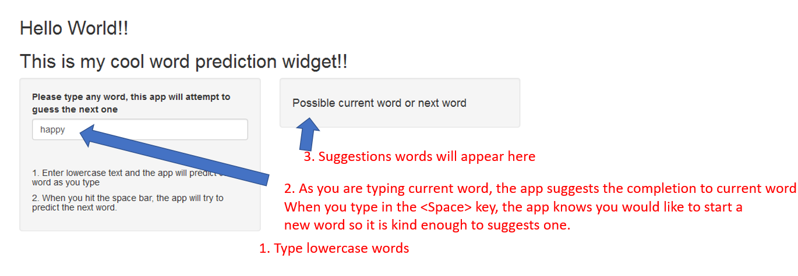

Shiny Key Prediction Application
========================================================
author: Arturo
date: 3/18/2017
autosize: true

Introduction
========================================================
Shiny Prediction Application 

- This project uses a language model that we had to build from various texts in order to predict the next word. 
- By using n-grams, or tokenizing different number of words together, we were able to determine the probability of what word is likely to come next.
- We find that the probablility of an upcoming word is P(W5 | W1,W2,W3,W4)
Although this looks difficult, once, with enough samples, you build brobablity of having many strings, you can use this history to predict the next word. 
- According to the Markov Assumption, instead of predicting all possible words in the english language, we can search a 5 n-gram list of words and use the first four as a search string. The most common 5th word in the N-gram database has a large probablilty of being the next word. 
- If you are unable to find 4 N-grams, in a search, you could instead find 3 N-grams in a 4 N-gram database. 
- Keep repeating until you get to none.

How to use my shiny web app
========================================================
I made the UI as simple as 1... 2... 3...! 

1. Type lowercase words 
2. As you are typing current word, the app suggests the completion to current word
When you type in the <Space> key, the app knows you would like to start a 
new word so it is kind enough to suggests one. 
3. Suggestions words will appear in box on right.

Cool Features 
========================================================

1. The coolest feature is the one you probably don't notice. The app loads almost instantaneously! This is because, although it takes a lot of time to extract the data, build Document Term Matrices, and build and sort N-gram lookup tables, it was all done and only the relevant objects were saved in an image. This image containing all required objects can then be imported in less than a second with all required functionality.

2. The second really cool feature of this shiny app is that it predicts the current word or next word dynamically as you are typing. Just like my iPhone:0 So, just by using the Server.R's renderText() function, I was able to process each character as it is typed. This alows the application to process text on the fly without having to press any "Activation Buttons".

3. The final cool feature is the ability to predict either the current word, or the next word just by looking for a space character. This feature immerses the user so they have to do nothing different and the next or current predicted word appears.

Links and URLs
========================================================
This is a link to my github location
[Link to github](https://github.com/asedo/shinyTextPrediction)

This is a link to my shiny app
[Link to Arturo's shiny app](https://artse.shinyapps.io/TextPrediction4Fun/)

This is a link to this presentation
[Link to Arturo's shiny app presentation](http://www.google.com)
